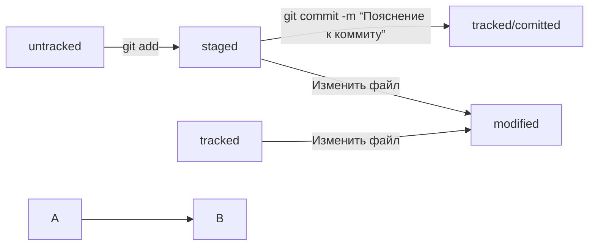

# Работа с git и github:
## pwd 
путь к текущей папке; 
## cd, cd ~, cd .. 
переход куда либо, переход в дом. директ., переход выше на один шаг; 
## ls 
вывод содержимого; 
## ls -a 
вывод содержимого и скрытых папок; 
## mkdir, mkdir -p 
создание папки, создание цепочки нескольких папок;  
## touch 
создание файла; 
## cp что_копируем куда, mv что_переносим куда 
копирование и перемещение файлов и папок; 
## cat 
чтение файлов; 
## rm, rmdir, rm -r  
удаление файла, удаление пустой папки, удаление папки и всего содержимого; 
## git version 
вывести версию git; 
## git config  -- global user.name и user.email 
внести данные юзера для глобальной работы;
## git init 
сделать папку репозиторием; 
## rm -rf .git 
разгитить папку( удалить файл .git), где r это рекурсивно, f это заставлять; 
## git status 
проверить статус репозитория;
## git add --all или имя файла 
подготовить файл к комиту;
## git commit -m “Пояснение к коммиту” 
выполнить коммит (после add); 
## git commit --amend --no-edit
добавить в существующий коммит файлы, комментарий к комиту не меняется (выполняется после git add);
## git commit --amend -m "Новое сообщение"
изменить комментарий к коммиту (если перед командой выполнить git add, добавятся новые файлы);
## git restore --staged (file)
удалить файл из списка staging area, добавленый командой git add;
## git reset --hard (commit hash)
откатиться к старому коммиту, указываем hash коммита, к которум нужно откатиться;
## git restore (file)
откатить изменения в файле, который еще не был добавлен в staging area командой git add;
## git log 
показать историю коммитов;
## git log --oneline
показать сокращенный log;
## git diff
сравнить изменения не закомиченного и неподготовленного файла с закомиченной версией;
## git diff --staged
сравнить изменения подготовленного к коммиту файла с предыдущей закомиченной версией;
## git diff hashOld hashNew
сравнить изменения старого и нового комита, порядок ввода хэшов можно менять местами;
## git diff branchOne branchTwo
сравнить две ветки (ветку можно сравнивать с конкретным коммитом);
## git diff branchOne~ HEAD~0...5... и т.д.
~ и номер указывает на предыдущие коммиты;
## echo "Новая строка файла" >> file.txt
добавить в конец файла новую строку;
## echo "Новая строка файла" > file.txt
удалить все строки файла и добавить новую строку;
## ls -la .ssh/ 
показать ключи ssh, команда вводится в домашней директории или там где хранятся ключи; 
## ssh-keygen -t ed25519 -C “электронная почта, зарегистрированная в github” 
создание ssh ключей;
## clip < ~/.ssh/id_ed25519.pub 
скопировать публичный ключ в буфер;
## ssh -T git@github.com 
показать ключ введенного сайта, чтобы сверить его с ключом на сайте;
## git remote add origin адрес_удаленного_репозитория 
связать локальный и удаленный репозитории;
## git remote -v 
проверить связанность репозиториев;
## git remote set-url origin новый_url
заменить ссылку репозитория на новую (например один github на другой);
## git remote rm origin
отвязать удаленный репозиторий (удалить origin);
## git push -u origin main или master 
первый пуш; 
## git push -u origin название_ветки
запушить ветку на удаленный репозиторий;
## git push origin название_ветки --force
принудительно перезаписывает ветку в удаленный репозиорий;
## git push 
сделать пуш, если пуш уже не первый;
## git pull
подтянуть изменения с удаленной ветки (репозитория) в свою локальную;
## git clone адрес_удаленного_репозитория 
клонировать удаленный репозиторий на компьютер  ( изменения влияют на оригинал);
## Fork 
делается в github, создает копию публичного репозитория в вашем github, после его можно склонировать на комп и изменять, не влияя на оригинал;
## untracked, tracked, staged и modified
4 статуса файлов в git;

## Файл .gitignore
содержит имена файлов и папок, которые нужно игнорировать при коммите;
## *, #, ?, /, [...], **, !
правила оформления файлов в .gitignore;
## git status --ignored
показать неотслеживаемые файлы;
## git branch 
показать существующие ветки;
## git branch -a
показать удаленные ветки (если репозиторий скачан с github то скачивается только ветка main);
## git branch (название/новой/ветки)
создать новую ветку;
## git merge (название_ветки_которую_сливают)
слить одну ветку в другую (нужно находится в ветке, в которую сливают);
## git branch -D или -d (название_ветки)
удалить ветку (-d мягкое удаление, ветки полностью слиты или они не отличаются);
## git checkout (название_ветки)
переключиться на другую ветку;
## git checkout -b (название_новой_ветки)
создать новую ветку и переключиться на нее;

# Работа с JDK в git:
## echo $JAVA_HOME 
показать содержание переменной $JAVA_HOME; 
## where java 
показать расположение JDK;
## java -version 
показать версию java;
## javac -encoding UTF-8 имя_java-файла.java 
создать из java файла байт код файл.class;
## java -Dfile.encoding=UTF-8 имя_байткода 
запустить байт код утилитой JRE;
## CHCP.com 65001 и потом chcp.com 1251 
если проблемы с выводом русского текста, сменить кодировку на UTF-8; 
## javac -d bin -encoding UTF-8 *.java 
создать байт код сразу из нескольких java файлов и положить в папку bin (создает папку);
## java -cp bin имя_стартового_класса 
запустить сразу несколько связанных файлов байт кода в папке bin;
## jar cfe имя_jar_архива.jar имя_стартового_класса -C bin . 
создать архив jar из файлов папки bin;
## java -jar имя_jar_архива.jar 
запустить программу (архив); 
## -- аргумент (передать пользовательский аргумент); 
## - аргумент (передать базовый короткий аргумент);
## java имя_байткода --аргумент1 --аргумент2 
запустить байт код и передать в него аргументы;